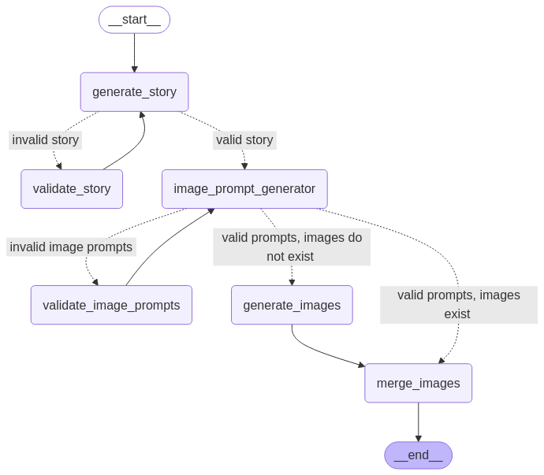

# Book Creator with LangGraph

A tool that automatically generates children's books with story text and matching illustrations.

## Features

- Story generation based on title and description
- Automatic image prompt generation
- Image creation using AI models
- Final book assembly with merged images and text

## Workflow

The book generation process follows this LangGraph workflow:



## Live Demo

You can try out the Book Creator application directly through our Streamlit app:

[Book Generator App](https://bookgeneratorapp.streamlit.app/)

The Streamlit interface provides a user-friendly way to generate books without setting up the local environment. Simply input your desired parameters through the web interface to create custom children's books.

## Example Book

Here's an example of a book generated using this tool:

### Cover Page


### Sample Pages


*"Geffen's underwater adventure" - A story about a 1 year old boy who goes on an adventure in the deep sea, featuring Geffen, a 1 year old boy with brown hair and blue eyes.*

## Setup

### Prerequisites

- Python 3.8 or higher
- Required Python packages:
  - streamlit
  - langgraph
  - langchain
  - fpdf
  - Pillow
  - python-pptx
  - litellm
  - python-dotenv
  - google-generativeai
  - langfuse

Install via:
```
pip install -r requirements.txt
```

### Environment Variables

Create a `.env` file in the root directory with the following variables:

```
GEMINI_API_KEY=your_gemini_api_key
LANGFUSE_SECRET_KEY=your_langfuse_secret_key
LANGFUSE_PUBLIC_KEY=your_langfuse_public_key
LANGFUSE_HOST=https://cloud.langfuse.com  # Or your custom Langfuse host
```

### Notes on API Keys:

- Get your Gemini API key from [Google AI Studio](https://aistudio.google.com/)
- Get your OpenAI API key from [OpenAI Platform](https://platform.openai.com/)
- For Langfuse tracking (optional), create an account at [Langfuse](https://langfuse.com/)

## Running Locally

1. Install dependencies:
   ```
   pip install -r requirements.txt
   ```

2. Run the application:
   ```
   python main.py
   ```

3. The application will generate a book based on the parameters in `main.py`. By default, it creates a story about "Sharki the friendly shark".

4. The output will be saved as a merged image and you'll see the details of the generated content in the console.

## Customization

Edit the parameters in the `graph.invoke()` call in `main.py` to change:
- Book title and number of pages
- Story description and characters
- Image style
- Model selection

## Output

- A merged book will be saved after generation
- The state of the generation process is logged in the console
- If Langfuse is enabled, the entire trace is available in your Langfuse dashboard 